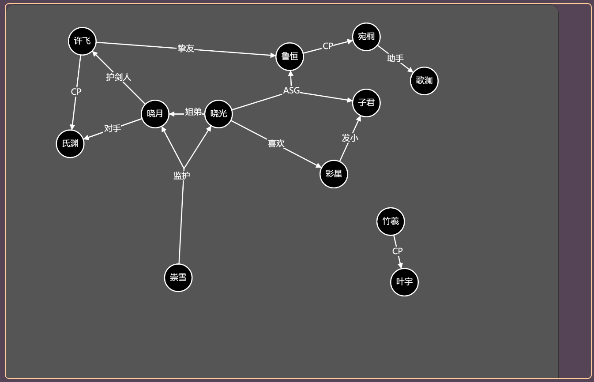
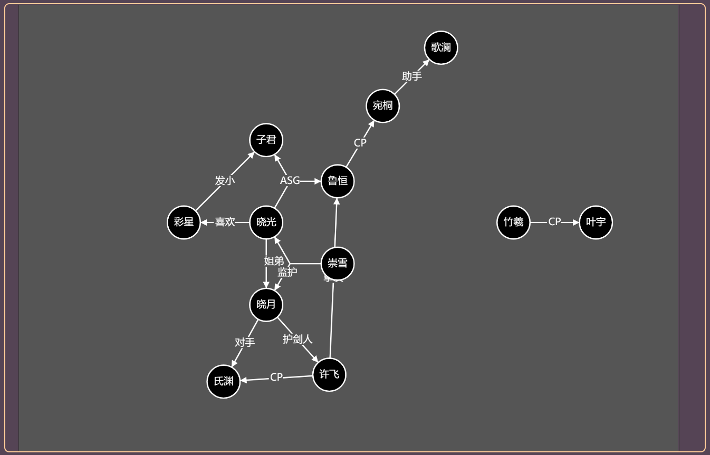

# 系网 - RelationNet
---

## 简介 - Introduction 
系网是一个专门绘制和生成关系图的web小工具。
旨在能让创作者更加专注于关系本身，而不是把珍贵的精力都浪费在绘制和修改图片上。

RelationNet is a web tool focusing on drawing and generating relationship networks.
It aims to make creators more concentrating on relationship, rather than wasting energy on drawing or modifying  images.

---

## 指南
**！！提示：尚有很多功能未完善，有什么问题请联系作者！！**
### 运行方法
下载全部文件，双击["index.html"](index.html)即可在浏览器中运行。
可以离线运行。
### 文件
- 新建：自默认模板新建一个RN关系网。
- 打开：打开一个由RN导出的JSON文件。
- 导出：导出一个JSON文件。
### 画布
- 平移：**按住中键**拖动。
### 节点
节点代表了一个人物或概念。
- 创建：在画布中空白处**单击右键**创建一个新的节点。
- 修改：**双击**节点进入编辑模式，**Enter**保存，**ESC**退出。
- 选中：在节点上**单击左键**切换选择，在画布上按**ESC**取消所有选择。
- 删除：选中节点后，按**Ctrl+X**删除节点及其连线。==注意：多点连线整个都会删除，后续版本将优化==。
- 拖动：**按住左键**拖动节点。
### 连线
用线将节点连接起来，以表现之间关系。支持多点连线。
- 创建：**右键拖动**创建连线，可以从节点和连线开始，到节点、连线和空白处结束。
- 修改：**双击**连线上文字进入编辑模式。
- 选中：**单击左键**连线上文字可选中。
- 删除：选中连线后，按**Ctrl+X**删除整个连线。
### 排列
- 最大中心排列：选择“排列”→“最大中心排列”，将以连线最多的节点为中心向外扩散，重新排列整个绘图。
    排列前：
    
    排列后：
    

---

## 操作
操作按键方法随着版本中的功能实现不断更新。
- 选择、消选选择节点：LMB
- 全部消选，取消文本修改：ESC
- 删除节点、关系：Ctrl+X
- 隐藏节点、关系：Ctrl+H
- 创建节点：RMB
- 创建关联节点：节点上RMB+拖动到空地
- 创建关系：节点上RMB+拖动到另一节点
- 平移画布：MMB+拖动
- 修改节点和关系文本：DLMB
- 保存文本修改：Enter

---

## 关于
联系作者：leemota@hotmailcom

---

## 更新
### 甲空零 - 1.0.0
- 文件功能：新建。打开。保存。导出。
- 节点：创建。修改。选中。删除。拖动。
- 连线：创建，修改。选中。删除。
- logo。
- 最大中心排列。、

## 计划
### 甲子零 - 1.1.0
- 多点连线删除优化。
- 款式：创建，修改，删除。
- 绘图：创建，复制，删除。
- 文件：重命名。
- 自由模式：
    打开自由模式开关，可进入自由模式。
    在自由模式中，只有关系重要。
    大小，位置等参数都会被忽略。
- 框选，按键复制节点
- 滚轮缩放视图

### 甲丑零 - 1.2.0
- 大纲：罗列全网的项目。
- 组织：创建，修改，删除。
    用组织囊括一组特定的节点。
    组织可以是非互斥的。

### 未定
- 款式：鼓励按照款式分类，每个小项的变动都会创建新的款式。
- 导出为单文件md。
- 基本的元素绘制：直线，圆，矩形，文本，折线，样条线。
- 节点：对齐，锁定，孤立，指定深度孤立，自动大小

自动排列：提供多种自动排列图中节点的方法。
- 最小交叉排列
- 指定中心排列
- 选定圆排列
- 直线排列

关系与连线：
- 特殊关系：可以定义某些常用的或者特殊的关系及其样式。
- 自动关系推测：例如血缘关系，可以家族推断。
- 交叉越过
- 筛选：按照关系来进行筛选和查找。
- 步点：指定关系连线要经过的虚拟点。

## 日志
### 20220513
- 增加了最大中心排列功能。
- 修复了少量问题。
### 20220512
- 增加了连线的修改，拖动，删除功能。
- 增加了输入框聚焦功能。
- 增加了创建连线功能。现在连线包括有E,P2P,P2L,L2L,L2P,L2E,P2E几种方式。
### 20220511
- v-for强制刷新函数化。
- 节点选中特效改为环状，由P5实现。
- 增加了ESC全部取消选择的快捷键。
- 在保存按钮可以显示未保存状态。
- 增加了导出功能，目前为导出成json原始文件。
- 增加了打开功能，能打开json原始文件。
- 增加了拖动节点功能。
- 增加了创建节点和创建关联节点的功能。
- 增加了删除节点的按键功能。
- 修正了箭头指向的问题。
### 20220510
- 基于v-for重写了节点控件的生成逻辑，可用但暂不采用其刷新方法。
- 设计了新的关系网络文件结构，压缩率降低但更容易访问。
